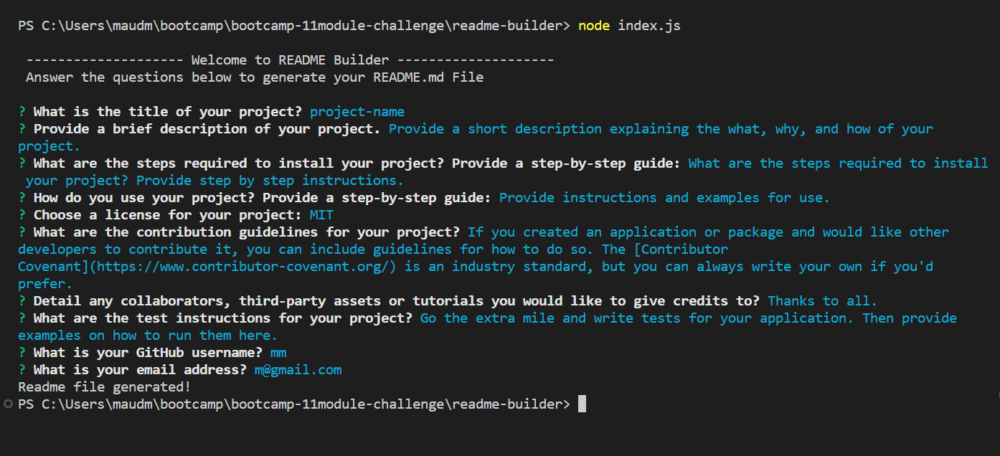
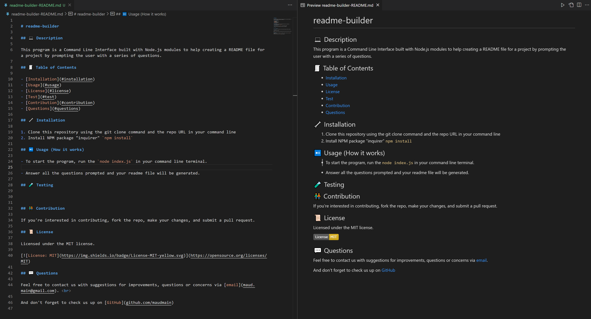

# readme-builder

## 💻 Description

This program is a Command Line Interface built with Node.js modules to help creating a README file for a project by prompting the user with a series of questions. This help minimazing the time spend  and streamline the process of creating a template for the readme file for each project.  

With this project I have learn how to:
- use Node.js and specific modules such as `Inquirer` and `fs`
- use the export/ import functions
- use the ES6 syntax
- use the regex syntax

## 🧾 Table of Contents

- [Installation](#installation)
- [Usage](#usage)
- [License](#license)
- [Test](#test)
- [Contribution](#contribution)
- [Questions](#questions)
    
## 🔧 Installation

1. Clone this repository using the git clone command and the repo URL in your command line
2. Install NPM package "inquirer" `npm install`

## ⏯️ Usage (How it works)

- To start the program, run the `node index.js` in your command line terminal. 
- Answer all the questions prompted

- Your readme file will be generated

[video-demo-link](https://drive.google.com/file/d/1aN0SwtXXKLHy2y-3Ro8Xs7-vp9MwHkv2/view)

## 🧪 Testing

## 🧑‍🤝‍🧑 Contribution

If you're interested in contributing, fork the repo, make your changes, and submit a pull request.

## 📜 License

Licensed under the MIT license.

     
## 💬 Questions

Feel free to contact us with suggestions for improvements, questions or concerns via [email](maud.main@gmail.com).  

And don't forget to check us up on [GitHub](github.com/maudmain)
